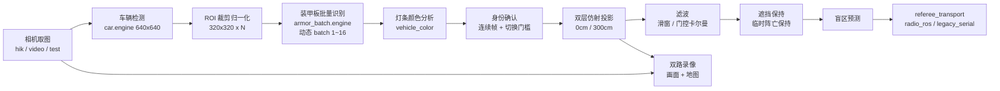

# SHARK Radar Vision

江南大学霞客湾校区 SHARK 战队 RoboMaster 2026 赛季**视觉雷达**。一台俯视全场的工业相机，经车辆检测、装甲板识别与双层仿射投影，输出对方机器人在 2800×1500 赛场地图上的坐标。

本仓库是 [shark-radar-system](https://github.com/JNU-SHARK/shark-radar-system) 的 `vision/` 子模块，也可独立使用。

## 本项目亮点

- **两级检测 + ROI 批量推理**：先检测车辆框，再把本帧所有车的 ROI 拼成一个 batch 送入动态 batch 装甲板引擎，一次推理拿下全场编号，而不是逐车串行。
- **双层仿射投影**：在 0 cm 与 300 cm 两个高度层各标一组点，按落点高度选层，解决高台与地面用同一套变换导致的偏差。
- **多重身份稳定机制**：阵营保持、装甲板连续确认、遮挡保持、临时阵亡保持四层叠加，抑制单帧误检和号码闪断造成的坐标跳变。
- **盲区预测**：对方进入相机盲区后，按角色预设的吊射点/兑矿点等关键位置继续预报，预测时长随信道占用动态调整。
- **门控卡尔曼滤波**：可选的混合滤波器，对原始观测和预测残差分别设跳变门限，异常观测不会污染轨迹。
- **Qt 比赛启动台**：相机检测、参数配置、标定、录像目录选择与一键启动集成在一个窗口，赛前不用碰命令行。
- **双路同步录像**：相机画面与标定地图同时编码，优先写外接硬盘，与无线电侧共用 `match_run_id` 归档。

## 1 功能介绍

雷达要在比赛中持续告诉裁判系统"对方每台机器人在哪"。视觉链路做的事：

1. **取图** — 海康工业相机 4024×3036，也支持 USB 相机与视频/图片测试模式。
2. **车辆检测** — YOLOv5 车辆模型输出车体框。
3. **装甲板识别** — 每个车框 ROI 归一化到 320×320，拼 batch 送装甲板模型，得到编号与颜色。
4. **阵营与身份确认** — 结合装甲板模型输出与灯条几何颜色，连续多帧一致才确认；已确认身份切换需要更多帧。
5. **投影** — 车框底部中心按双层仿射变换映射到赛场坐标。
6. **滤波与预测** — 滑动窗口或门控卡尔曼平滑，遮挡时保持，进盲区后预报。
7. **发送** — 默认通过同机 ROS 2 交给无线电侧统一发裁判系统。

## 2 系统架构

### 2.1 数据流



### 2.2 两条算法链路

`config.yaml` 的 `algorithm.mode` 选择：

- **`legacy`**（默认，比赛使用）— 逐帧检测 + 身份确认 + 保持机制的成熟链路。
- **`hkust_tracker`** — `tracking/` 下以车辆轨迹为中心的可选链路，检测结果先关联到轨迹再做身份判定，卡尔曼预测参与遮挡恢复。

两条链路共用相机、投影、滤波和发送环节，只在"检测结果如何变成稳定目标"这一段不同。

### 2.3 通信

比赛默认 `referee.transport: radio_ros`：视觉不开串口，把目标遥测以 20 Hz 发到同机 ROS 2 话题 `/rm_radar_algorithm/telemetry`，由无线电侧融合后限速到 4.8 Hz 写裁判串口。这样避免两个进程抢同一个串口设备，也让无线电的全场敌情能参与融合。

融合后视觉在整套系统里承担两个角色：**己方坐标的唯一来源**（无线电只播对方信息，己方十二台里的六台只能靠视觉），以及**敌方坐标在无线电断流时的回退**。敌方目标正常情况下以无线电为主来源，因为它全场无遮挡。这也是遥测里 `state` 字段要区分 `measured` / `occlusion_hold` / `blind_prediction` / `missing` 的原因 —— 融合侧要知道这一帧的位置是真实观测还是缓存/外推，才能判断回退接不接得住。

`legacy_serial` 是回退方案，视觉直接开 `/dev/ttyUSB0` 自己发。只在无线电侧不可用时使用。

## 3 环境

| 项目 | 版本 / 型号 |
| --- | --- |
| 操作系统 | Ubuntu 22.04 LTS |
| GPU | NVIDIA RTX 系列（需支持 `h264_nvenc`） |
| CUDA | 12.8 |
| TensorRT | 10.13.3.9 |
| PyTorch | 2.11.0+cu128 |
| Python | 3.10 |
| 相机 | 海康工业相机 USB3，4024×3036 |
| 相机 SDK | 海康 MVS（Linux） |
| Qt | PyQt5 5.15.11 |

`requirements.txt` 里的版本是锁死的。TensorRT 引擎与构建时的 TensorRT 版本强绑定，换版本必须重新转换引擎；PyTorch 与 CUDA 的组合也要对应，否则 `.pt → .onnx` 这一步会出问题。

## 4 安装部署

### 4.1 依赖

```bash
git clone https://github.com/JNU-SHARK/shark-radar-vision.git
cd shark-radar-vision

python3 -m venv .venv
source .venv/bin/activate
pip install -r requirements.txt
```

启动脚本会优先用项目内的 `.venv/bin/python`，找不到才回落系统 `python3`。建议就用 `.venv`。

### 4.2 海康 MVS SDK

从海康官网下载 Linux 版 MVS 安装。启动脚本会在 `/opt/MVS/lib`、`/opt/MVS`、`/usr/local/MVS/lib` 三个常见位置自动探测 `libMvCameraControl.so` 并设置 `MVCAM_COMMON_RUNENV` 与 `LD_LIBRARY_PATH` — 桌面自启动不会读交互式 shell，所以这一步必须由脚本自己做。

相机 USB 权限：

```bash
sudo cp scripts/99-hikrobot-usb.rules /etc/udev/rules.d/
sudo udevadm control --reload-rules && sudo udevadm trigger
```

### 4.3 模型引擎转换

仓库里带了 `.pt` / `.onnx` / `.engine` 三种形态。**`.engine` 与构建机器的 GPU 和 TensorRT 版本绑定，换机器必须重新生成**：

```bash
# 车辆模型与静态装甲板模型
python3 onnx2engine.py

# 可选：动态 batch 装甲板引擎（min=1, opt=8, max=16 @ 320x320）
python3 scripts/build_armor_batch_engine.py \
    --weights models/armor.pt \
    --output models/armor_batch.engine \
    --device 0
```

`armor_batch.engine` 不存在时程序自动回退到 `armor.engine` 的 4×4 静态拼图模式（`fallback_canvas_size: 1280`），能跑但吞吐低一些。

### 4.4 ROS 2（比赛默认通信方式需要）

`referee.transport: radio_ros` 需要 ROS 2 Humble 可用。启动脚本会自动 source `/opt/ros/humble/setup.sh`。如果只用 `legacy_serial` 串口方式，可以不装 ROS。

### 4.5 开机自启（可选）

```bash
./scripts/install_autostart.sh      # 卸载：./scripts/uninstall_autostart.sh
```

装的是桌面自启动项（`shark-radar-launcher.desktop`），开机进桌面后自动弹出比赛启动台。

## 5 启动

三种入口，用途不同：

```bash
./scripts/start_launcher.sh    # 推荐。加载 ROS 与 MVS 环境后启动 Qt 启动台
python3 launcher.py            # 直接起启动台（需自己保证环境变量已就绪）
python3 main.py                # 跳过启动台与标定，直接用现有配置和标定文件比赛
python3 calibration.py         # 单独进标定
python3 config_editor.py       # 单独改配置
```

比赛用 `start_launcher.sh`。`main.py` 适合标定没变、只是重启程序的情况 — 前提是 `calibration.run_after_save` 之前已经存过标定文件。

## 6 功能详解：Qt 比赛启动台

`launcher.py`。赛前所有操作都在这一个窗口完成。

### 6.1 相机状态

顶部实时显示相机检测结果。多相机时按 `camera_params.device_serial` 指定序列号，留空则用枚举列表的第一台。

### 6.2 比赛设置

| 项 | 说明 |
| --- | --- |
| 相机类型 | 海康工业相机 / USB 相机 |
| 相机序列号 | 留空则使用第一台海康相机 |
| 录制视觉画面 + 标定地图 | 启动比赛后自动录制 |
| 录像目录 | 优先扫描已挂载可写的外接硬盘，未检测到则用项目内 `save_img/`。可手动「选择录像存储目录」 |
| 通信方式 | 无线电 ROS2（比赛默认）/ 传统串口 |

每场录像存到所选目录下带统一 `match_run_id` 的子目录，与无线电侧的 IQ 和事件流对得上。

### 6.3 标定与测试

| 项 | 说明 |
| --- | --- |
| 标定点数 | 每个高度层的点数，至少 4；大于 4 时用多点拟合 |
| 保存标定后自动进入比赛 | 对应 `calibration.run_after_save` |

### 6.4 三个动作按钮

- **保存比赛配置** — 把窗口里的设置写回 `config.yaml`。会校验录像路径确实是个目录。
- **开始标定** — 拉起 `calibration.py`。
- **启动比赛主程序** — 拉起 `main.py`。

标定或比赛进程在跑时不能重复启动，会提示先停止当前程序。

## 7 功能详解：手动标定

`calibration.py`。左边相机画面，右边赛场地图，两边成对点击建立对应关系。

### 7.1 双层标定

分 0 cm 与 300 cm 两个高度层，每层各标 `points_per_layer` 个点（默认 6）。层数固定为 2，对应地面和高地/环形高地的落点高度。点数超过 4 时用多点最小二乘拟合而不是四点透视，抗单点误差更好。

点位共线或顺序错误时会报"高度 N 多点拟合失败"，检查点的分布和点击顺序。

### 7.2 己方阵营

标定窗口的阵营选项会**自动写回 `config.yaml` 的 `global.state`**，红蓝方地图与标定文件（`arrays_test_red.npy` / `arrays_test_blue.npy`）随之切换。阵营配置不合法时启动会直接报错而不是默默用错的地图。

### 7.3 地图预制方案

「地图预制」菜单可以保存、导入、删除标定方案（`calibration_presets.json`），换场地时不用从头点。

导入时会校验点数一致 — 每层 6 点的方案不能导入到设置为每层 4 点的会话里。导入会替换当前已选地图点，操作前有确认提示。

**注意**：预制方案只保存地图侧的点，相机图像侧的点仍需手动标 — 相机位置每次架设都不同，没法复用。

## 8 功能详解：主程序运行界面

`main.py` 运行时开三个窗口（尺寸在 `config.yaml` 的 `ui` 段调）：

| 窗口 | 内容 |
| --- | --- |
| 相机画面 | 车辆框、装甲板框、编号与阵营标注；`debug_overlay` 打开后还显示模型色、灯条色、置信度与有效灯条数 |
| 标定地图 | 全部目标在赛场地图上的落点，含遮挡保持与盲区预测的位置 |
| 信息面板 | 帧率、各目标状态、通信状态等运行时信息 |

`ui.show_armor_canvas` 是调试用的 ROI 拼接画布，关闭可以省掉每帧的复制、绘制与窗口刷新开销，比赛时应关闭。

## 9 配置详解

`config.yaml` 参数很多，按段落理解：

| 段 | 内容 |
| --- | --- |
| `global` | 己方阵营、相机模式、多车识别开关、地图尺寸、测试模式视频路径 |
| `algorithm` | 链路选择（`legacy` / `hkust_tracker`）、轨迹器阈值、ROI 尺寸、身份判定、丢失预测 |
| `calibration` | 每层点数、保存后是否自动进比赛 |
| `recording` | 帧率、编码器、分辨率上限、队列深度、外接盘优先策略与目录 |
| `projection` | 投影点来源（`car_bottom` / `armor_bottom`）与比例系数 |
| `inference` | 两个模型的输入尺寸、装甲板置信度阈值 |
| `armor_selection` | 车框内多个装甲板的取舍（`center` / `confidence`） |
| `vehicle_color_hold` | 阵营判定与保持的全部参数（灯条几何、HSV 门限、连续确认帧数） |
| `armor_confirmation` | 装甲板连续确认帧数、跨帧匹配容差、允许的编号 |
| `armor_duplicate` | 重复编号去重范围（`class` / `number`） |
| `occlusion_hold` | 遮挡后保持最后位置的最长秒数 |
| `temporary_death_hold` | 号码丢失但车框仍在时的处理 |
| `referee_send` | 是否只发送已确认标定的目标 |
| `referee` | 通信方式与遥测速率 |
| `filter` / `filter_compare` | 滤波类型与参数；影子对比滤波（仅调试展示，不参与发送） |
| `blind_zone` | 盲区预测开关、参与角色、预测时长、各角色关键点位 |
| `camera_params` | 曝光、增益、目标相机序列号 |
| `ui` | 三个窗口的尺寸与调试画布开关 |

### 9.1 几处值得注意的设计

**阵营判定不只看灯条颜色**。`vehicle_color_hold` 把装甲板模型输出的颜色和灯条几何提取的颜色交叉验证（`require_model_agreement`），两者一致才累计确认帧数。灯不亮时允许高置信度模型单独判定，但需要更多连续帧且会被更强的反色灯光阻止。黄色灯条按红方处理（`yellow_as_red`）。灯条提取时清掉中间 20% 的数字区域，只用左右各 40% 的灯区，避免数字笔画干扰颜色统计。

**远距离的退化处理**。极小装甲板（框高 ≤ 16 px）的灯条不再细长，`allow_compact_light_pair` 允许用左右对称的两个光点代替，但置信度打 0.7 折并要求更多连续帧。单侧灯条（遮挡或极远）也允许，打 0.55 折。

**`double_vulnerability.enabled: false`**。视觉侧不再自主触发双倍易伤，决策统一由无线电侧负责。旧的视觉策略参数保留仅供历史参考。

**投影点默认用车框底部中心**（`car_bottom`，比例 0.5 / 0.92）而不是装甲板下方。车框底部更接近车辆与地面的接触点，地图落点更准；`armor_bottom` 保留用于车框不稳定时的对比。

## 10 录像存储

双路编码：相机画面按比例压到 `camera_max_width: 2560`，地图压到 `map_max_width: 1920`，都走 `h264_nvenc` 硬件编码，不可用时依次回退 `libx264` / `mp4v` / `MJPG`。

`queue_size: 4` 是约 0.2 秒的短缓冲，用来吸收编码抖动 — 只有队列满了才算真正的录像丢帧。主循环偶发停顿时允许在 `max_catchup_seconds: 1.0` 内补齐时间轴，避免成片时长被压缩。

存储位置优先外接硬盘（`prefer_external: true`），目录 `SHARK-radar-recordings`；未检测到可写外接盘则用项目内 `save_img/`。启动台里操作者确认过的实际路径会写入 `selected_root`。

## 11 测试

```bash
source .venv/bin/activate
python3 -m pytest tests -v
```

`tests/` 下 11 个测试文件，覆盖标定预制、相机可用性、配置编辑、帧率统计、MVS 运行时、录像存储、裁判传输、运行时状态、轨迹链路、阵营颜色判定、视频录制。都不需要真实相机。

辅助工具：

```bash
python3 camera_availability.py     # 检查相机能否出图
python3 make_mask.py               # 生成落点判断掩码
python3 frame_rate.py              # 帧率统计
```

## 12 文件结构

```
shark-radar-vision/
├── launcher.py                 # Qt 比赛启动台
├── main.py                     # 比赛主程序
├── calibration.py              # 手动标定（双层仿射）
├── calibration_presets.py      # 地图预制方案管理
├── config_editor.py            # 配置编辑器
├── config.yaml                 # 全部运行参数
├── detect_function.py          # YOLOv5 TensorRT 推理封装
├── vehicle_color.py            # 灯条颜色分析与阵营保持
├── hik_camera.py               # 海康相机控制
├── mvs_runtime.py              # MVS SDK 运行时定位
├── camera_availability.py      # 相机可用性检查
├── referee_transport.py        # radio_ros / legacy_serial 双通道
├── vision_telemetry.py         # 目标遥测组装
├── runtime_status.py           # 运行时状态上报
├── video_recorder.py           # 异步双路录像
├── recording_storage.py        # 外接盘优先的录像目录选择
├── information_ui.py           # 信息面板绘制
├── onnx2engine.py              # ONNX → TensorRT 引擎
├── export.py                   # YOLOv5 导出（上游）
├── make_mask.py                # 落点掩码生成
├── tracking/                   # 可选的轨迹中心链路
│   ├── pipeline.py             # 链路编排
│   ├── tracker.py              # 车辆轨迹管理
│   ├── kalman.py               # 卡尔曼滤波
│   └── roi_batch.py            # ROI 批量拼接
├── RM_serial_py/               # 裁判系统串口协议
├── models/                     # car / armor / armor_batch 的 pt/onnx/engine
├── images-2026/                # 2026 赛场地图与掩码
├── yaml/                       # 模型结构定义
├── utils/ · MvImport*/         # YOLOv5 工具链 · 海康 SDK 绑定
├── scripts/
│   ├── start_launcher.sh           # 推荐启动入口
│   ├── build_armor_batch_engine.py # 动态 batch 引擎构建
│   ├── 99-hikrobot-usb.rules       # 相机 USB 权限
│   └── install_autostart.sh        # 开机自启安装
└── tests/                      # 11 个测试
```

## 13 开源文档

视觉链路的完整技术文档正在整理中。

- [ ] 双层仿射投影推导与标定实践
- [ ] 阵营判定与身份确认策略
- [ ] 盲区预测与滤波器设计

## 14 参考资料

单目雷达站这条路线已经有不少队伍走过，本仓库的检测与投影思路参考了下面这些开源：

| 来源 | 说明 |
| --- | --- |
| [RM2025 香港科技大学 ENTERPRIZE 战队单目雷达站算法开源](https://bbs.robomaster.com/article/761138) | 单目雷达站算法开源，附完整赛季的易伤时间数据 |
| [RM2026 厦理PFA 雷达站算法开源](https://bbs.robomaster.com/article/1884254) | 厦门理工学院 PFA 单目相机雷达站算法与算法详解文档 |

无线电侧的参考资料见 [聚合仓库 README](https://github.com/JNU-SHARK/shark-radar-system#10-参考资料)。

## 许可

MIT License。

本项目基于 [YOLOv5](https://github.com/ultralytics/yolov5) 二次开发，`utils/`、`models/`、`export.py` 等目录保留上游代码，感谢 Ultralytics 的工作。
